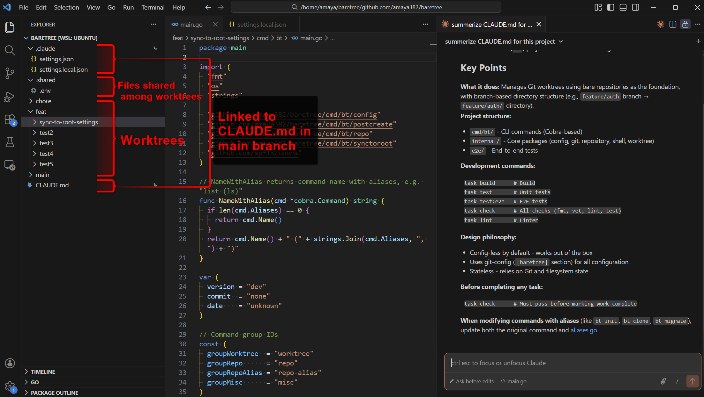

> [!WARNING]
> **This is an experimental project that is not yet thoroughly tested; use with caution as breaking changes are likely. Bug reports and contributions are welcome.**

<h1 align="center">🪾 baretree</h1>

<p align="center"><b>Git repositories, worktrees, and branches, organized.</b></p>

baretree combines centralized repository management (inspired by [ghq](https://github.com/x-motemen/ghq)) with powerful Git worktree support. Manage all your repositories in one place, keep branches organized, and switch contexts instantly.

## Why baretree?

### Before
```
~/projects/
├── my-app/                    # main branch... or was it develop?
├── my-app-feature/            # Which feature branch is this?
├── my-app-auth-backup/        # Forgot to delete after merge
├── my-app-hotfix-20240115/    # Old hotfix, still needed?
└── ...scattered everywhere
```

### After
```
~/baretree/                              # All repositories organized
├── github.com/
│   └── user/
│       ├── my-app/                      # One repository
│       │   ├── .git/                    # Bare repository
│       │   ├── .shared/                 # Shared across all worktrees (.env, etc.)
│       │   ├── main/                    # worktree ← main branch
│       │   └── feature/
│       │       ├── auth/                # worktree ← feature/auth branch
│       │       └── api/                 # worktree ← feature/api branch
│       └── another-project/
└── gitlab.com/
    └── ...
```

- **All worktrees in one directory** - No more scattered clones for each branch
- **Shared files across worktrees** - `.env`, `node_modules` linked automatically
- **Instant context switching** - Jump between worktrees (`bt cd`) and repositories (`bt go`)
- **Migrate existing repos instantly** - One command converts any repository
- **Centralized repository management** - All repos in `~/baretree/{host}/{user}/{repo}`
- **AI Agent ready** - Parallel tasks and isolated workspaces for AI coding assistants

## 🚀 Quick Start

### 1. Install

```bash
# Homebrew (macOS/Linux)
brew install amaya382/tap/baretree

# GitHub Release (download binary)
# Download from https://github.com/amaya382/baretree/releases
# Extract and add to your PATH
# Example for Linux (amd64)
curl -L https://github.com/amaya382/baretree/releases/latest/download/baretree_Linux_x86_64.tar.gz | tar xz
sudo mv bt /usr/local/bin/
```

### 2. Shell Integration (required for `bt cd`)

This is required for `bt cd` and completion, however, you can skip the manual setup if installed via Homebrew (shell integration is automatically configured).

> **Note (Homebrew users):** After installing via Homebrew, open a new terminal window for shell integration to take effect.

```bash
# Bash
echo 'eval "$(bt shell-init bash)"' >> ~/.bashrc && source ~/.bashrc

# Zsh
echo 'eval "$(bt shell-init zsh)"' >> ~/.zshrc && source ~/.zshrc

# Fish
echo 'bt shell-init fish | source' >> ~/.config/fish/config.fish && source ~/.config/fish/config.fish
```

---

## 📖 Getting Started

Choose your style: **Centralized** (recommended) or **Standalone**.

### Option A: Centralized (Recommended)

Manage all repositories in a central location (`~/baretree` by default).

#### Migrate existing repositories to baretree managed directory

```bash
cd ~/projects/my-existing-repo
bt migrate . --to-managed  # or -m
# Your repo is now baretree-structured and placed under ~/baretree
# Working tree state (staged, unstaged, untracked) is preserved
# Original repository is preserved by default (use --remove-source to delete)
bt go my-existing-repo
```

#### Clone a new repository

```bash
# Clone to ~/baretree/github.com/user/repo
bt get user/repo  # Defaults to github.com
bt get github.com/user/repo # With domain
bt get git@github.com:user/repo.git # By full URL
```

#### Navigate between repositories

```bash
bt repos                  # List all repositories
bt go my-repo             # Jump to repository
bt go user/repo           # Jump with more specific path
```

#### Work with worktrees

```bash
bt add -b feature/auth            # Create feature branch
bt cd feature/auth                # Jump to worktree
bt ls                             # List all worktrees
bt rm feature/auth                # Remove when done
bt unbare main ~/standalone-repo  # Export worktree as standalone repo
```

### Option B: Standalone (without centralized management)

Use baretree for a single project without centralized repository management.

#### Start fresh

```bash
bt init my-project
cd my-project
bt cd @
# Start coding!
```

#### Migrate an existing repository in-place

```bash
cd ~/projects/my-repo
bt migrate . --in-place
# Your repo is now baretree-structured
# Working tree state (staged, unstaged, untracked) is preserved
```

#### Clone to a specific location

```bash
bt clone git@github.com:user/repo.git ~/projects/my-project
cd ~/projects/my-project
```

#### Work with worktrees

```bash
bt add -b feature/auth            # Create feature branch
bt cd feature/auth                # Jump to worktree
bt ls                             # List all worktrees
bt rm feature/auth                # Remove when done
bt unbare main ~/standalone-repo  # Export worktree as standalone repo
```

---

## 🔗 Post-create Actions

Automate worktree setup with shared files and commands that run on creation.

### Shared Files

Share files like `.env` or `node_modules` across all worktrees automatically.

```bash
# Add shared files (symlink by default, stored in .shared/ directory)
bt post-create add symlink .env
bt post-create add symlink node_modules

# Use copy instead of symlink for files that need independent copies
bt post-create add copy .env

# Use --no-managed to source from default branch instead of .shared/
bt post-create add symlink .env --no-managed
```

### Commands

Run commands automatically when creating new worktrees.

```bash
# Add commands to run after worktree creation
bt post-create add command "npm install"
bt post-create add command "direnv allow"
```

Commands are executed in the new worktree directory. Failures are warnings (won't block worktree creation).

### More commands

```bash
bt post-create list              # Show configured actions
bt post-create apply             # Apply to all worktrees
bt post-create remove .env       # Remove configuration
bt post-create remove "npm install"  # Remove command
```

---

## 🔗 Sync to Root

Make files from the default branch worktree accessible at the repository root via symlinks. This is useful for tools that need to find configuration files at the project root.

Common use cases:
- **AI agent configuration**: `CLAUDE.md`, `.claude/`, `.cursorrules`, `.github/copilot-instructions.md`
- **Editor settings**: `.idea/`, `.vscode/` (when opening project root as workspace)
  - Note: For VS Code, [Multi-Root Workspaces](https://code.visualstudio.com/docs/editor/multi-root-workspaces) is recommended over `sync-to-root`
- **Other root-level configs**: Any file that tools expect at the repository root

```bash
# Sync AI agent config
bt sync-to-root add CLAUDE.md
bt sync-to-root add .claude

# Sync editor settings
bt sync-to-root add .idea

# Use a different target path
bt sync-to-root add docs/guide.md guide.md

# List configured entries
bt sync-to-root list

# Remove entry
bt sync-to-root remove CLAUDE.md

# Re-apply all symlinks
bt sync-to-root apply
```

After configuration:
```
project/
├── .git/
├── CLAUDE.md -> main/CLAUDE.md     # Accessible from root
├── .claude -> main/.claude         # Accessible from root
├── main/
│   ├── CLAUDE.md
│   ├── .claude/
│   └── ...
└── feature/auth/
```

---

## 🤖 AI Agent Integration

baretree's worktree-based structure is ideal for AI coding assistants like Claude Code, Cursor, and GitHub Copilot Workspace. Each worktree provides an isolated workspace.

### Recommended Setup: Open Project Root as Workspace

For the best experience with AI agents and editors, open the **project root** (not individual worktrees) as your workspace:

```bash
# Open the project root in your editor
code ~/baretree/github.com/user/my-project  # VS Code
cursor ~/baretree/github.com/user/my-project  # Cursor

# Start Claude Code from the project root
cd ~/baretree/github.com/user/my-project
claude
```

Then use `sync-to-root` to make AI configuration files accessible from the root:

```bash
bt sync-to-root add CLAUDE.md
bt sync-to-root add .claude
bt sync-to-root add .cursorrules  # For Cursor
```

This setup provides:
- **Unified view**: See all worktrees (main, feature/auth, etc.) in one workspace
- **AI config at root**: `CLAUDE.md` and `.claude/` are recognized by AI agents
- **Easy context switching**: Jump between worktrees without changing windows
- **Consistent rules**: Agent rules apply across all worktrees

Your project structure:
```
my-project/                      # <- Open this as workspace
├── .git/
├── CLAUDE.md -> main/CLAUDE.md  # AI agents see this
├── .claude -> main/.claude      # AI agents see this
├── main/
│   ├── CLAUDE.md                # Actual file
│   ├── .claude/
│   └── src/
└── feature/
    └── auth/                    # Work on features here
```



> [!TIP]
> **Having trouble with VS Code debugger, source control, or `.vscode/` settings in worktrees?** VS Code's [Multi-Root Workspaces](https://code.visualstudio.com/docs/editor/multi-root-workspaces) lets you add each worktree as a separate workspace folder, so per-worktree settings like debug configurations work correctly.

### Agent Rules Template

An example rules file for AI agents is available at [`examples/rules/`](examples/rules/). See [`examples/README.md`](examples/README.md) for details.

Copy to your project's rules directory:

```bash
# For Claude Code
cp examples/rules/working-directory-on-git-worktree-with-baretree.md ~/.claude/rules/

# For Cursor
cp examples/rules/working-directory-on-git-worktree-with-baretree.md .cursor/rules/
```

---

## 📚 Command Reference

### Worktree Management

| Command | Description |
|---------|-------------|
| `bt add <branch>` | Add worktree (`-b` for new branch) |
| `bt list` / `bt ls` | List worktrees |
| `bt remove` / `bt rm` | Remove worktree (`--with-branch` to delete branch) |
| `bt cd <name>` | Switch to worktree (`@` for default, `-` for previous) |
| `bt status` | Show repository status |
| `bt repair` | Repair worktree/branch name mismatches |
| `bt rename [old] <new>` | Rename worktree and branch |
| `bt unbare <wt> <dest>` | Convert worktree to standalone repository |
| `bt root` | Show repository root directory path |

### Repository Management (Centralized)

| Command | Alias | Description |
|---------|-------|-------------|
| `bt repo get <url>` | `bt get` | Clone to baretree root (centralized-style) |
| `bt repo list` | `bt repos` | List all managed repositories |
| `bt repo cd <name>` | `bt go` | Jump to a repository |
| `bt repo migrate <path> --to-managed` | `bt migrate` | Migrate and move to baretree managed directory |
| `bt repo remove <name>` | `bt repo rm` | Remove a baretree repository |
| `bt repo root` | | Show baretree root directory |
| `bt repo config` | | Manage global configuration |

### Repository Management (Standalone)

| Command | Alias | Description |
|---------|-------|-------------|
| `bt repo init [dir]` | `bt init` | Initialize new baretree repository |
| `bt repo clone <url> [dest]` | `bt clone` | Clone to specific location |
| `bt repo migrate <path> -i` | `bt migrate` | Convert existing repo in-place |
| `bt repo migrate <path> -d <dest>` | `bt migrate` | Convert and copy to destination |

### Post-create Actions

| Command | Description |
|---------|-------------|
| `bt post-create add symlink <file>` | Add shared file as symlink |
| `bt post-create add copy <file>` | Add shared file as copy |
| `bt post-create add command <cmd>` | Add command to run on creation |
| `bt post-create remove <source>` | Remove action |
| `bt post-create list` | List configured actions |
| `bt post-create apply` | Apply to existing worktrees |

### Sync to Root

| Command | Description |
|---------|-------------|
| `bt sync-to-root add <source> [target]` | Symlink file/dir from default worktree to repo root |
| `bt sync-to-root remove <source>` | Remove entry and symlink |
| `bt sync-to-root list` | List configured entries |
| `bt sync-to-root apply` | Re-apply all symlinks |

### Configuration

| Command | Description |
|---------|-------------|
| `bt config default-branch` | Get or set the default branch |
| `bt config export` | Export repository config to TOML |
| `bt config import` | Import repository config from TOML |
| `bt repo config root` | Get or set the baretree root directory |
| `bt repo config export` | Export global config to TOML |
| `bt repo config import` | Import global config from TOML |

---

## ⚙️ Configuration

All configuration is stored in git-config (no extra config files needed).

### Default Branch

Get, set, or unset the default branch for a repository (used for post-create files and sync-to-root):

```bash
bt config default-branch              # Show current default branch
bt config default-branch develop      # Set to 'develop'
bt config default-branch --unset      # Remove setting (reverts to 'main')
```

### Baretree Root

Get, set, or unset the root directory where repositories are stored (default: `~/baretree`):

```bash
bt repo config root                   # Show current root directory
bt repo config root ~/code            # Set root to ~/code
bt repo config root --unset           # Remove setting (reverts to ~/baretree)
```

You can also use environment variable (takes precedence over the command setting):

```bash
export BARETREE_ROOT=~/code
```

> [!TIP]
> Set baretree root to `~/ghq` to use baretree alongside ghq.
> Run `bt repo migrate -i .` to add worktree support in each repository.

---

## 📦 Install

### Homebrew (macOS/Linux)

```bash
brew install amaya382/tap/baretree
```

### GitHub Release (Binary)

Download the latest binary from [GitHub Releases](https://github.com/amaya382/baretree/releases):

```bash
# Example for Linux (amd64)
curl -L https://github.com/amaya382/baretree/releases/latest/download/baretree_Linux_x86_64.tar.gz | tar xz
sudo mv bt /usr/local/bin/

# Example for macOS (Apple Silicon)
curl -L https://github.com/amaya382/baretree/releases/latest/download/baretree_Darwin_arm64.tar.gz | tar xz
sudo mv bt /usr/local/bin/
```

### [In preparation] Snap (Linux)

```bash
sudo snap install baretree --classic
```

### [In preparation] Scoop (Windows)

```powershell
scoop bucket add amaya382 https://github.com/amaya382/scoop-bucket
scoop install baretree
```

### From Source

```bash
go install github.com/amaya382/baretree/cmd/bt@latest
```

---

## 🔧 Troubleshooting

### `bt cd` doesn't work

Make sure shell integration is enabled:

```bash
# Check if the shell function and the command exist
type bt
type -p bt

# Re-add shell integration
eval "$(bt shell-init bash)"  # or zsh/fish
```

### Symlinks don't work on Windows

1. Enable Developer Mode (Windows 10+)
2. Or use `--type copy` instead

### Can't remove worktree (uncommitted changes)

```bash
bt rm feature/branch --force
```

### Worktree and branch names don't match

```bash
bt repair --dry-run --all     # Preview changes
bt repair --all               # Fix (use branch name as source)
bt repair --source=dir --all  # Fix (use directory name as source)
```

---

## 📋 Requirements

- Git 2.15+
- Go 1.23+ (building from source)

## Related Projects

- [ghq](https://github.com/x-motemen/ghq) - Repository management tool (inspiration for `bt repo get/list/remove`)
- [wtp](https://github.com/satococoa/wtp) - Worktree management tool (inspiration for `bt post-create`)
